# Desafio AWS CloudFormation — Minha Primeira Stack

Documentação do desafio de projeto **AWS CloudFormation**, do bootcamp
**GFT - Fundamentos de Cloud com AWS** (plataforma [DIO](https://www.dio.me/)).

Este laboratório implementa, do zero, uma **stack** com AWS CloudFormation, aplicando os
conceitos de **Infraestrutura como Código (IaC)**. Aqui ficam registrados o template
utilizado, o passo a passo do deploy real na AWS (com screenshots) e os aprendizados da
prática.

---

## Índice

1. [Objetivo do desafio](#1-objetivo-do-desafio)
2. [O que é o AWS CloudFormation](#2-o-que-é-o-aws-cloudformation)
3. [Arquitetura da solução](#3-arquitetura-da-solução)
4. [Anatomia de um template](#4-anatomia-de-um-template)
5. [O template do projeto](#5-o-template-do-projeto)
6. [Adaptações sobre o material da aula](#6-adaptações-sobre-o-material-da-aula)
7. [Passo a passo da prática](#7-passo-a-passo-da-prática)
8. [Recursos criados na AWS](#8-recursos-criados-na-aws)
9. [Insights e aprendizados](#9-insights-e-aprendizados)
10. [Limpeza dos recursos](#10-limpeza-dos-recursos)
11. [Estrutura do repositório](#11-estrutura-do-repositório)
12. [Referências](#12-referências)

---

## 1. Objetivo do desafio

O desafio propõe implementar a **primeira stack com AWS CloudFormation** e documentar a
experiência. Ao final, deve-se ser capaz de:

- Aplicar os conceitos de **Infraestrutura como Código (IaC)** em um ambiente prático;
- Documentar processos técnicos de forma clara e estruturada;
- Utilizar o **GitHub** para compartilhar documentação técnica.

O entregável é este repositório: um template CloudFormation funcional, o registro do
deploy real e as anotações de aprendizado.

---

## 2. O que é o AWS CloudFormation

O **AWS CloudFormation** é o serviço de **Infraestrutura como Código (IaC)** da AWS.
Em vez de criar recursos manualmente clicando na console, você **descreve a
infraestrutura desejada em um arquivo de texto** (um *template* em YAML ou JSON) e o
CloudFormation provisiona tudo automaticamente.

**Conceitos centrais:**

| Conceito | Descrição |
|----------|-----------|
| **Template** | Arquivo YAML/JSON que descreve os recursos a serem criados. |
| **Stack** (pilha) | O conjunto de recursos criados a partir de um template. Gerenciar a stack = gerenciar todos os recursos juntos. |
| **Recurso** | Cada componente AWS declarado no template (uma EC2, um bucket S3, etc.). |

**Vantagens:**

- **Automação** — sobe uma arquitetura inteira com poucos cliques.
- **Reutilização** — o mesmo template serve para vários ambientes (dev, prod...).
- **Versionamento** — o template é texto, então vai para o Git e tem histórico.
- **Consistência** — elimina o erro humano da configuração manual.
- **Custo** — você paga apenas pelos recursos criados, não pelo uso do CloudFormation.

> Existem outras ferramentas de IaC no mercado, como **Terraform** e **AWS CDK**.
> O CloudFormation é a solução nativa da AWS.

---

## 3. Arquitetura da solução

A stack deste projeto cria **5 recursos** em uma única execução:

```
                      Stack: desafio-cloudformation
   ┌───────────────────────────────────────────────────────────┐
   │                                                           │
   │   ┌─────────────────────────────┐                         │
   │   │  Security Group             │   libera portas 80 + 22  │
   │   │  ┌───────────────────────┐  │                         │
   │   │  │  EC2 Instance         │  │   Amazon Linux 2023      │
   │   │  │  + Apache (UserData)  │  │   t2.micro               │
   │   │  └───────────────────────┘  │                         │
   │   └─────────────────────────────┘                         │
   │                                                           │
   │   ┌──────────────┐   ┌───────────────┐  ┌──────────────┐  │
   │   │  Bucket S3   │   │  Grupo IAM    │←─│  Usuário IAM │  │
   │   └──────────────┘   └───────────────┘  └──────────────┘  │
   │                                                           │
   └───────────────────────────────────────────────────────────┘
```

- **EC2 + Apache** — uma instância Linux que instala o servidor web Apache no primeiro
  boot e publica uma página HTML.
- **Security Group** — o "firewall" da instância, liberando as portas 80 (HTTP) e 22 (SSH).
- **Bucket S3** — armazenamento de objetos.
- **Grupo + Usuário IAM** — um usuário de identidade associado a um grupo.

---

## 4. Anatomia de um template

Um template CloudFormation é organizado em seções. As principais:

| Seção | Obrigatória? | Para que serve |
|-------|:---:|----------------|
| `AWSTemplateFormatVersion` | Não | Versão do formato do template (`2010-09-09`). |
| `Description` | Não | Texto livre explicando o que o template faz. |
| `Parameters` | Não | Valores informados no momento do deploy — deixam o template reutilizável. |
| `Mappings` | Não | Tabelas estáticas de consulta chave → valor (ex.: por região). |
| `Resources` | **Sim** | A única seção obrigatória. Declara os recursos AWS a criar. |
| `Outputs` | Não | Valores retornados após a criação (IDs, URLs, nomes). |

Cada recurso em `Resources` segue o padrão:

```yaml
NomeLogico:
  Type: AWS::Servico::Recurso     # ex.: AWS::EC2::Instance
  Properties:
    Chave: Valor                  # configuração do recurso
```

**Funções intrínsecas** usadas neste projeto:

- `!Ref` — referencia outro recurso ou parâmetro.
- `!Sub` — substitui variáveis dentro de um texto (ex.: `${AWS::AccountId}`).
- `!FindInMap` — busca um valor na seção `Mappings`.
- `Fn::Base64` — codifica texto em Base64 (exigido pelo `UserData` da EC2).

---

## 5. O template do projeto

O arquivo principal é [`templates/projeto-cloudformation.yaml`](templates/projeto-cloudformation.yaml).
Ele **consolida em uma única stack** os conceitos que, no material da aula, estavam
espalhados em 4 templates separados. Assim, sobe-se **uma stack só** — economizando
custo e evitando recursos duplicados — e ainda assim demonstram-se todos os conceitos.

**Recursos criados:**

| Recurso lógico | Tipo | O que faz |
|----------------|------|-----------|
| `GrupoSeguranca` | `AWS::EC2::SecurityGroup` | Firewall liberando as portas **80** (HTTP) e **22** (SSH). |
| `EC2Instance` | `AWS::EC2::Instance` | Instância Linux que instala o **Apache** no primeiro boot via `UserData` e publica uma página HTML. |
| `S3Bucket` | `AWS::S3::Bucket` | Bucket S3 com nome único por conta. |
| `IAMGroup` | `AWS::IAM::Group` | Grupo IAM `GPO-ADMIN-LAB`. |
| `IAMUser` | `AWS::IAM::User` | Usuário IAM associado ao grupo. |

**Parâmetros do template:**

| Parâmetro | Função |
|-----------|--------|
| `InstanceType` | Tipo da EC2 (`t2.micro` ou `t3.micro`). |
| `KeyName` | Par de chaves para acesso SSH (selecionado no deploy). |
| `LatestAmiId` | Resolve a AMI mais recente do Amazon Linux 2023 automaticamente, via SSM. |

**Saídas (`Outputs`):** ID da instância, **URL do site**, nome do bucket e nome do usuário IAM.

---

## 6. Adaptações sobre o material da aula

O material da aula (`templates/01-EC2.yaml` a `04-EC2_S3_UserGroup.yaml`) foi mantido
no repositório **como referência**. O template do projeto, porém, foi reescrito para
corrigir problemas que impediriam o deploy e para reunir os conceitos das 4 aulas:

| Material original | Problema | Adaptação no projeto |
|-------------------|----------|----------------------|
| 4 templates separados | Subir as 4 stacks cria 3–4 instâncias EC2 → custo e recursos repetidos | **Um único template/stack** reunindo todos os conceitos |
| `04`: `BucketName: S3-FOUNDATION` | Nome de bucket S3 inválido (maiúsculas) e não único globalmente | `!Sub s3-foundation-${AWS::AccountId}` (minúsculas + único) |
| `04`: AMI Ubuntu fixa (`ami-0c55b...`) | AMIs fixas ficam desatualizadas e variam por região | Parâmetro SSM que resolve a **AMI mais recente** automaticamente |
| `04`: `VpcId` fixo na conta do professor | Não existe na minha conta → deploy falha | Removido o `VpcId`; uso de `SecurityGroups` na VPC default |
| `04`: `KeyName: your-key-pair-name` | Placeholder inválido | Parâmetro `KeyName` do tipo `AWS::EC2::KeyPair::KeyName` |
| `04` não tinha Apache nem porta 80 | Faltavam os conceitos dos vídeos 02 e 03 | Adicionados `UserData` com Apache e regra de porta 80 |

> **Observação sobre `Mappings`:** o template `04` usava `Mappings` para escolher a AMI
> por região. Como AMIs fixas envelhecem, troquei essa escolha por um parâmetro SSM.
> Para não perder o conceito, mantive um bloco `Mappings` (`RegiaoInfo`) usado para
> preencher uma *tag* de localização — o conceito segue demonstrado.

---

## 7. Passo a passo da prática

Deploy real executado na região **us-east-1 (Norte da Virgínia)**.

### Pré-requisito — Criar o Key Pair

A instância EC2 exige um par de chaves para acesso SSH. Em **EC2 → Key Pairs → Create
key pair**, criei a chave `key-desafio-cloudformation` (tipo **RSA**, formato **`.pem`**).

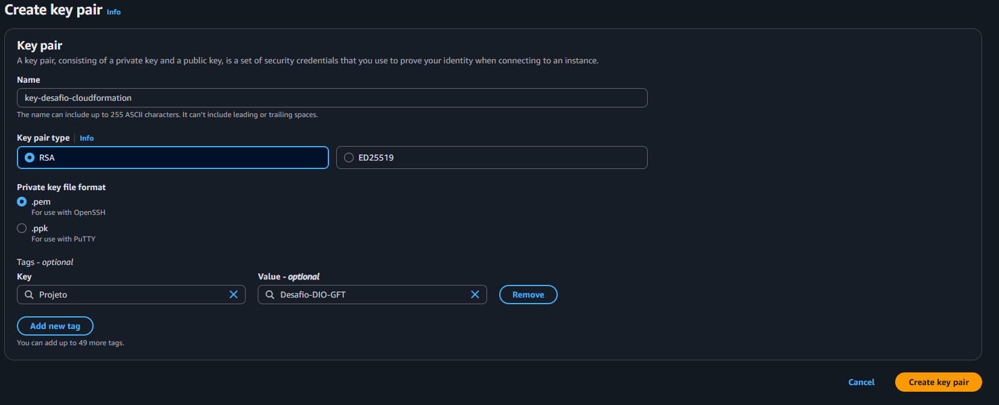

### Etapa 1 — Upload do template

No serviço **CloudFormation → Create stack → With new resources**, escolhi
**Upload a template file** e enviei o arquivo `projeto-cloudformation.yaml`.

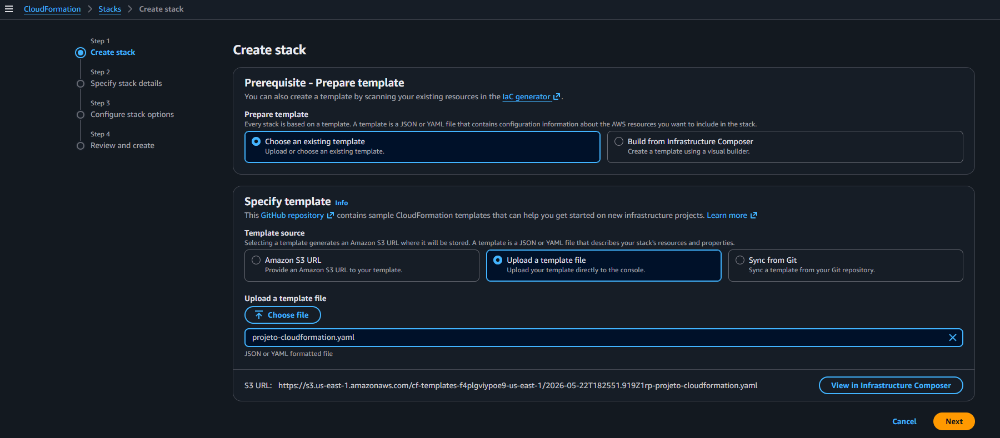

### Etapa 2 — Parâmetros da stack

Defini o nome da stack como `desafio-cloudformation` e preenchi os 3 parâmetros:
`InstanceType` = `t2.micro`, `KeyName` = `key-desafio-cloudformation` e `LatestAmiId`
no valor padrão.

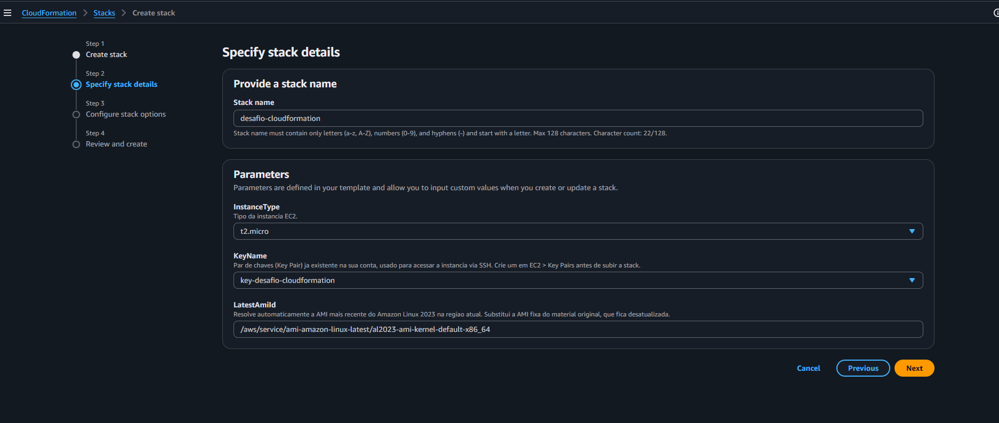

### Etapa 3 — Opções da stack

Na tela de opções, adicionei a tag `Projeto = Desafio-DIO-GFT`. É **obrigatório** marcar
o checkbox de **Capabilities** (`CAPABILITY_IAM`), pois a stack cria recursos IAM
(grupo e usuário).

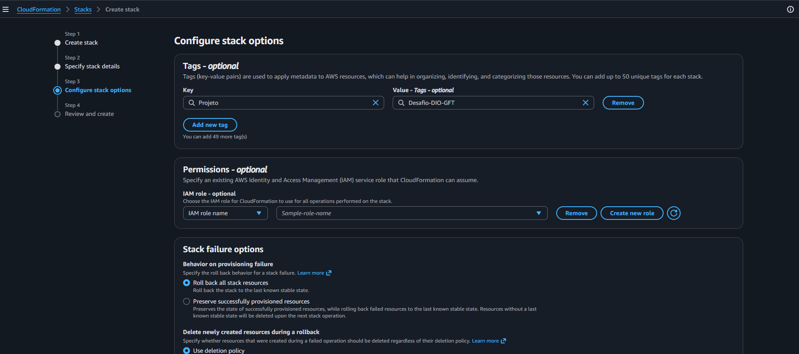

### Etapa 4 — Revisão

Revisão de tudo que foi configurado antes de criar a stack.

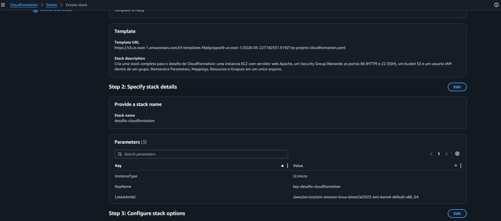

### Etapa 5 — Stack criada com sucesso

Após o **Submit**, o CloudFormation provisionou os **5 recursos**, todos com status
`CREATE_COMPLETE`.

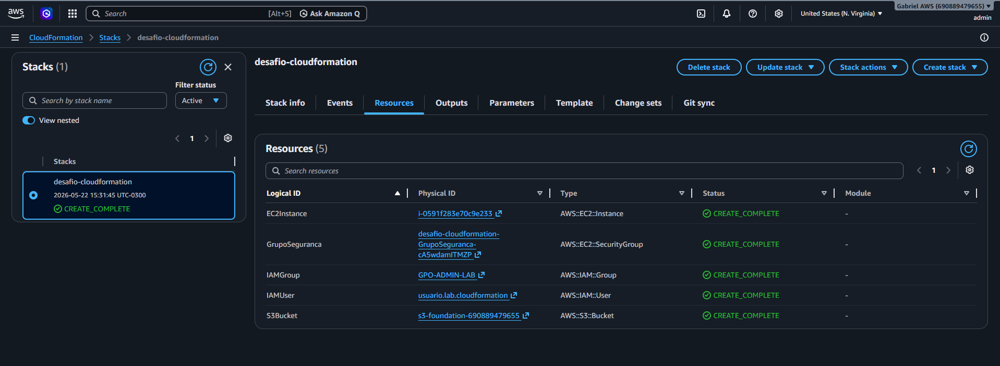

### Etapa 6 — Outputs da stack

A aba **Outputs** retorna os valores úteis definidos no template: ID da instância,
`WebsiteURL`, nome do bucket S3 e nome do usuário IAM.

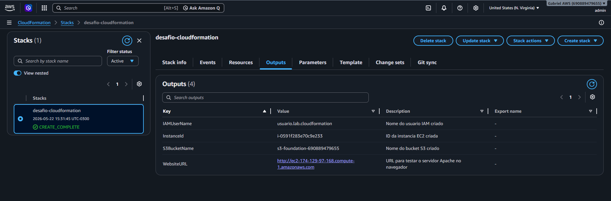

### Etapa 7 — Testar o servidor Apache

Abrindo a `WebsiteURL` no navegador, aparece a página servida pelo Apache — instalado
automaticamente pelo `UserData` durante a criação da instância.

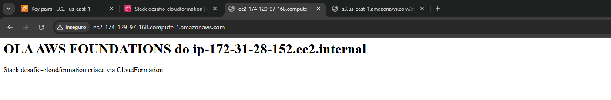

---

## 8. Recursos criados na AWS

Comprovação, em cada serviço, dos recursos provisionados pela stack.

**Instância EC2** — `t2.micro`, status *Running*, com a tag `Name = Webserver-CloudFormation`:

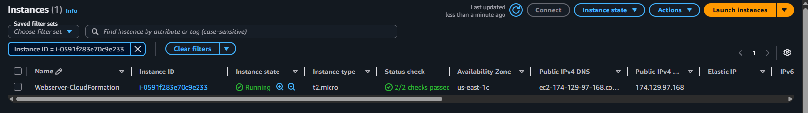

**Security Group** — regras de entrada liberando as portas 80 (HTTP) e 22 (SSH):

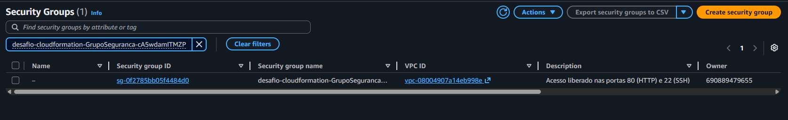

**Bucket S3** — `s3-foundation-690889479655` (o sufixo é o ID da conta, garantindo nome único):

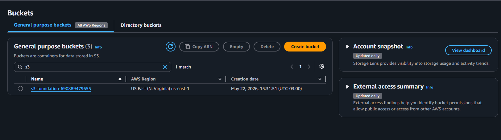

**Usuário IAM** — `usuario.lab.cloudformation`, associado ao grupo `GPO-ADMIN-LAB`:

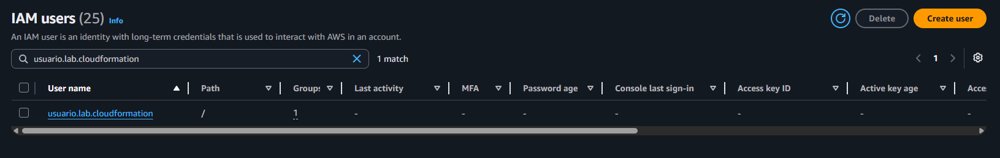

**Template interpretado pela AWS** — o YAML enviado, lido pelo CloudFormation:

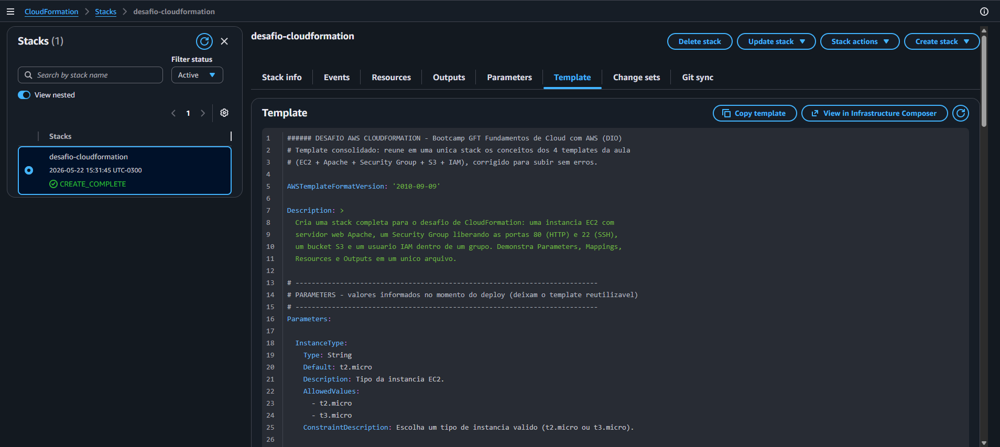

---

## 9. Insights e aprendizados

- **IaC muda a forma de pensar infraestrutura.** Em vez de "clicar para criar", você
  *descreve o estado desejado* e a AWS reconcilia. A infraestrutura vira código
  revisável, versionável e repetível.
- **A stack é uma unidade de ciclo de vida.** Criar, atualizar e — principalmente —
  **destruir** tudo de uma vez evita recursos órfãos gerando custo.
- **Templates do material precisam de revisão crítica.** AMIs e VPCs são específicas
  de conta/região/data; copiar sem adaptar leva a falhas no deploy. Resolver a AMI via
  **SSM Parameter** foi o aprendizado técnico mais valioso desta prática.
- **Nomes de recursos têm regras.** O bucket S3 precisa de nome **globalmente único e
  em minúsculas** — usar `${AWS::AccountId}` no `!Sub` garante isso.
- **Recursos IAM exigem confirmação explícita** (`CAPABILITY_IAM`), uma trava de
  segurança para evitar criação acidental de permissões.
- **`UserData` automatiza a configuração do servidor**, não só a criação da máquina:
  a EC2 já nasce com o Apache instalado e rodando.

---

## 10. Limpeza dos recursos

Para **não gerar custos**, ao terminar a prática:

1. No CloudFormation, selecione a stack `desafio-cloudformation`.
2. Clique em **Delete** e confirme.
3. O CloudFormation remove **todos os recursos** da stack automaticamente.
4. Confirme que a instância EC2 foi para o estado *terminated* no painel do EC2.

> Atenção: um bucket S3 com objetos dentro pode impedir a exclusão da stack — esvazie
> o bucket antes, se necessário.

---

## 11. Estrutura do repositório

```
.
├── README.md                           # este documento
├── templates/
│   ├── projeto-cloudformation.yaml      # template consolidado (o que sobe na AWS)
│   ├── 01-EC2.yaml                      # material da aula — referência
│   ├── 02-Apache.yaml                   # material da aula — referência
│   ├── 03-Firewall.yaml                 # material da aula — referência
│   └── 04-EC2_S3_UserGroup.yaml         # material da aula — referência
└── images/                             # screenshots do deploy real (01 a 13)
```

---

## 12. Referências

- [Documentação oficial — AWS CloudFormation](https://docs.aws.amazon.com/cloudformation/)
- [Referência de tipos de recurso](https://docs.aws.amazon.com/AWSCloudFormation/latest/UserGuide/aws-template-resource-type-ref.html)

---

Desafio desenvolvido como parte do bootcamp **GFT - Fundamentos de Cloud com AWS** — DIO.
